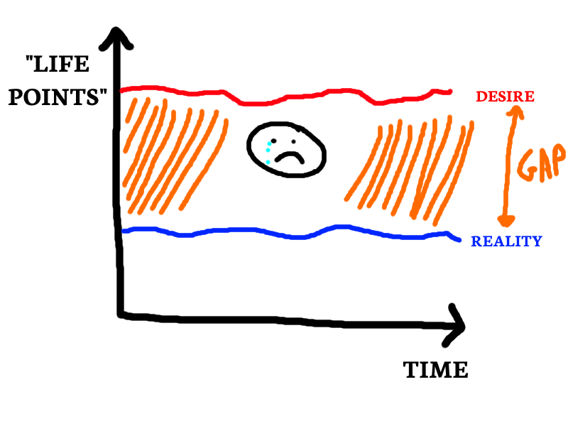
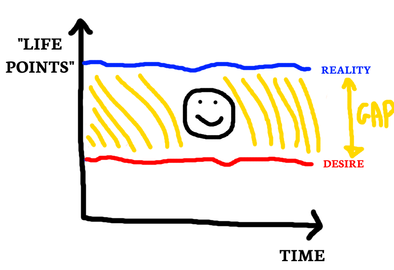
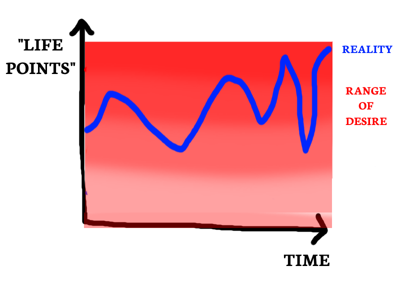

It seems fairly clear to me is that there's often a gap between "what we have" and "what we want".

If I were to accurately model this gap using Science(TM) and Art(TM) it'd look something like this:

<!--more-->

Obviously, this gap could be either way around. We could have **more** than we want, or we could have **less** than we want.

I'd bet a small amount of money that for most of us, this gap exists the "negative" way around far, far more often.

I'm not going to wonder why this is the case. (And I'm also not going to talk about how [our perception could be flawed](https://www.walkingoncustard.com/the-world-in-our-heads/) and whether we're accurately measuring the 'reality' line when see how we're doing. But do remember that that line might not be where we think it is.)

Let's just take it for granted that this gap exists and is mostly negative. What can we do about it?

## The Natural Approach

I think the most human way to fix this is to try and move the 'reality' line UP, so it goes above the 'desire' line:

And the way we do this is _usually_ by attempting to obtain the things we want. Like the proverbial donkey, we chase after the carrot, believing once we get it our 'reality' line will move up above 'desire' and happiness will be achieved.

(In practice, this means aiming for the new relationship, career, possession, or experience that takes our "life points" tally above the desired amount.)

Unfortunately, this approach rarely succeeds, for various reasons including **difficulty** (it's hard to achieve our aims), **self-sabotage** (sometimes we don't really want the things we think we do), **actual sabotage** (people get in our way), or **moving goalposts** (when we get the thing we want, we find we just want the next thing).

So the approach that seems most obvious doesn't usually solve the problem. We need another plan.

## The Other Approach

If we think for a couple of minutes, we could come up with the idea that we could just move the _other_ line downwards. Mathematically, this would be just as effective at closing the gap as moving the 'reality' line up.

This idea is fairly familiar to us too - it's commonly thought of as a spiritual, "Zen", hippy-dippy idea: "Eliminate your desires! Be free of the ego!" And so on.

But this can be just as impossible a strategy. Desire can become a stick to beat ourselves with.

Someone's Inner Critic: If I were a BETTER person I wouldn't want this! I'm BAD for wanting anything!

This is obviously not a route to happiness either.

Worse, we're not really mathematical beings. Just because the outcome of the sum is the same on these very-scientific graphs I'm doodling, it doesn't mean that this translates into human experience.

Put another way, if I desire to eat, then letting go of the desire doesn't make me any less hungry.

A life of zero desire is a life of zero satisfaction. Eventually we reach a point where we can't drop the 'desire' line any further.

So, neither single approach will work. As always, there's no [One Answer](https://www.walkingoncustard.com/the-one-answer/) which solves all our problems. However...

## The Fluid Approach

Once we've learned that pure desire doesn't work, and pure anti-desire doesn't work, there's only one possibility remaining: _be fluid_.

Sometimes we lower the 'desire' line by letting go of desires that no longer serve us, or that can't happen, or that cost us more by wanting them than we could ever receive by obtaining them.

Sometimes we raise the 'reality' line by trying harder, stopping our self-sabotage, growing, changing... or just being damn lucky.

Either way, we grasp lightly, allowing our desire line to widen and become an entire range. It'd be great to reach the top of the range, but it's good just to be within it.

## What does this mean in practice?

It means putting in work.

Inner critic: Damn and curses!

Sorry. It's true. Left to our own devices, we'll probably make ourselves unhappy.

But if we put in a bit of work to analyse our desires, we can see which ones to let go of, and which ones to pursue.

## Does this solve all imaginable problems?

No. [But nothing does](https://www.walkingoncustard.com/the-one-answer/)! Even this "fluid approach" isn't the One Answer!

That's right, we have to be fluid about adopting a fluid approach. (Meta-fluid, if you like).

Sometimes this fluid approach will be helpful, and will free us from a [custard trap](https://www.walkingoncustard.com/wow-totally-explained-anxiety-using-custard/) we've created for ourselves.

And sometimes it won't. That's fine. We have to just [keep reframing our problems](https://www.walkingoncustard.com/novelty-blindness-fresh-perspectives/) until we find the particular perspective that helps in our current situation.

Through that fluidity, we can find happiness. And maybe that's something we can all desire.
