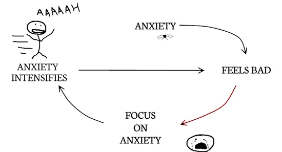

\[I originally wrote this article for the [Huffington Post](http://www.huffingtonpost.co.uk/neil-hughes/ 'Huffington Post') - click [here](http://www.huffingtonpost.co.uk/neil-hughes/comedy-and-anxiety_b_7052738.html 'Huffington Post') to see it in its natural habitat\]

Laughter is the best medicine.

(Unless you're trying to treat insomnia, in which case laughter is at best highly inconvenient or - more likely - annoying beyond belief.)

But how useful is laughter for the anxious? As an occasional stand-up comedian and full-time worrier, I think I'm well-placed to answer that.

<!--more-->

Inner critic: You mean "waffle at length while pretending to know what you're talking about", right? As usual?

Yeah. Yeah, that.

I've been worried... forever. Whether it's "I feel a bit unnecessarily tense" or "oh god I'm dying and had better cancel everything NOW", I've lived with anxious discomfort for a long time.

In my darkest moments, the last thing I would think about is laughter. All I could do was obsess over whatever my anxiety had fixated on at that moment - the fizzing sensation in the brain, the raised heartbeat, whatever object my worries had latched onto and magnified beyond all proportion.

But one of my core beliefs has always been the importance of laughter. I love to take difficult topics and find the humour in them. There's something deeply human about laughing in the face of death, sickness and misery.

Of course, not all laughter is helpful. There's a difference between laughing in the face of anxiety, and laughing at the anxious themselves. As with all humour, both intention and target make all the difference to the final result.

For me, I've found that laughing at my own nervous absurdity brings a dose of reality to the out-of-control fears playing havoc in my mind. And for this laughter to be a positive experience, it must be born out of love.

Inner critic: Oh god, he's going on about "being born out of love" again. This is embarrassing.

My inner critic is, as usual, sceptical. But it's true. Believing in our own value allows us to laugh at ourselves - and our situation - without the laughter being barbed and painful.

Loving ourselves - however cheesy that sounds - makes it possible for laughter to be healing, and not simply beating ourselves up further when we already feel low.

But even if we manage to laugh in a positive manner, how does it help? Well, a huge part of the struggle is that an anxious episode is all-consuming. It is nearly impossible to focus on anything except the anxiety... and this obsessive focus creates a feedback loop that only feeds it further:

This feedback loop can quickly get out of control.

_Anything_ that changes our reaction to the bad feeling (this reaction is represented by the reddish arrow in the expertly-doodled diagram) helps to break this loop, and keep the anxious episode from becoming a full-blown panic attack.

And that includes laughter.

Now, when I feel anxiety arising, instead of responding with frustration, fear, or sadness I go out of my way to find something funny in the situation. Even a little black humour helps:

Oh good, I feel anxious again. I was really hoping this would happen, as I didn't want to enjoy myself today.

It doesn't have to be laugh-out-loud hilarious, but it keeps me from feeding the anxiety with further unpleasant feelings.

It's tough to be hilarious on demand, and not all of us can easily find something to laugh at in dark moments - but perhaps you have that "go-to" YouTube clip that makes you laugh every time? Maybe you could use it to raise a smile whenever you feel the onset of anxiety. Or you could text a friend who knows how to make you laugh no matter what.

Anything that prevents you from going around that loop can help you escape the worst of an anxious episode.

This isn't a cure-all. Anxiety is complicated, and there's generally no simple trick to get rid of it forever.

But it's certainly possible to combine many lessons to reduce it to a manageable load. I hope this idea of reacting to anxiety with a positive emotion can be a helpful addition to your anxiety toolkit - whether you use laughter, acceptance, ironic joy, or whatever you find works best for you.

I've spent the last couple of years getting to the bottom of my anxiety, finding the root causes of it, and developing a set of tools to handle it when it arises. Laughter is just one tool, but it's one of my favourites.

After all this work, for the first time in years, I don't fear the return of anxiety anymore. I know I can handle it when it comes.

Or, at least, I can have a laugh at its expense. And that counts for something too.

---
